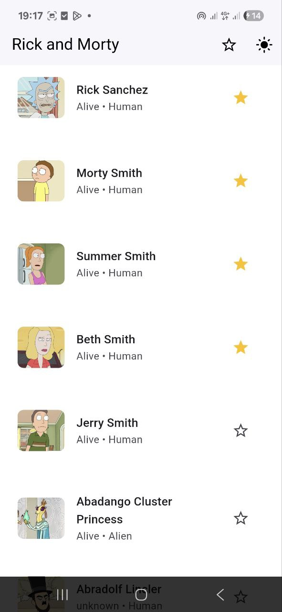
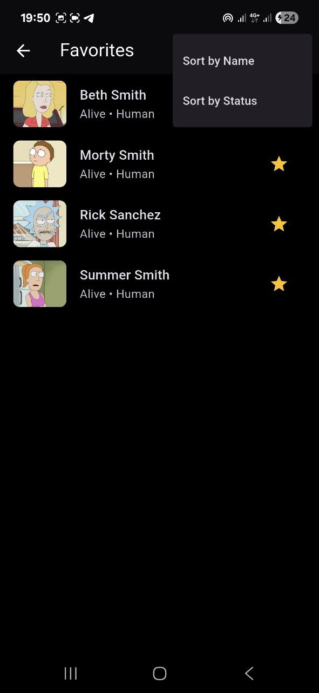
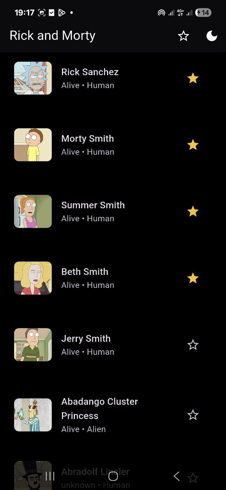
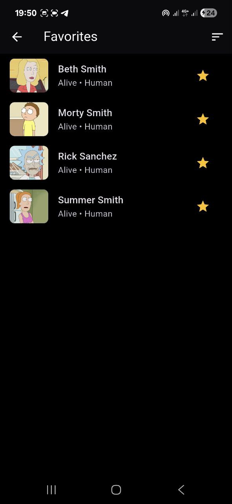

# 🧩 Приложение Rick and Morty

Мобильное и веб-приложение на **Flutter**, которое отображает список персонажей из мультсериала **"Рик и Морти"**  
с использованием официального публичного API [Rick and Morty API](https://rickandmortyapi.com/).

Приложение поддерживает:
- Загрузку персонажей с API  
- Добавление в избранное  
- Оффлайн-режим с кешированием (Hive)  
- Поддержку светлой и тёмной темы  
- Полностью адаптивный дизайн (телефон, планшет, веб)  
- Пагинацию и плавные анимации  

---

## 🚀 Функционал приложения

### 📜 **Главный экран (Home Page)**
- Отображает список всех персонажей с фото, именем, статусом и видом.  
- Подгружает данные постранично (пагинация).  
- При прокрутке автоматически загружает следующую страницу.  
- При клике на персонажа — переход на экран с детальной информацией.  
- Поддерживает адаптивную сетку (1 колонка — телефон, 2 — планшет, 4 — веб).  
- Кнопка ⭐ открывает экран избранного, кнопка ☀️/🌙 переключает тему.  

---

### ⭐ **Экран избранного (Favorites Page)**
- Отображает всех добавленных в избранное персонажей.  
- Работает оффлайн благодаря `Hive`.  
- Можно удалять персонажей из избранного.  
- Данные сохраняются между сессиями.  
- Поддерживает сортировку по имени или статусу (опционально).  
- Интерфейс адаптируется под разные размеры экрана.  

---

### 👤 **Экран деталей персонажа (Detail Page)**
- Отображает **подробную информацию о персонаже**, включая:  
  - 🧾 **Имя** персонажа  
  - ⚙️ **Статус** (Alive, Dead, Unknown)  
  - 👽 **Вид (Species)**  
  - 📍 **Местоположение (Location)** — где персонаж находится  
  - 🪐 **Происхождение (Origin)** — откуда он родом  
- Используется **Hero-анимация** для плавного перехода от карточки к экрану деталей.  
- Изображение отображается в высоком качестве с помощью `CachedNetworkImage`.  
- Кнопка ⭐ позволяет **добавить или удалить персонажа из избранного** прямо с экрана деталей.  
- Поддерживает **адаптивный дизайн** — изображение и текст масштабируются под размер экрана.  
- Реализовано **корректное извлечение данных из API**, чтобы не отображались некорректные фразы вроде:  
  > ❌ `status specifies location`  
  Теперь используется безопасное обращение к вложенным полям:  
  ```dart
  location: map['location']?['name'] ?? 'Unknown',
  origin: map['origin']?['name'] ?? 'Unknown',
## 🖼 Screenshots

<p align="center">
  
  
  
  
  
  
</p>
## 🎬 Demo Preview

<p align="center">
  
</p>
